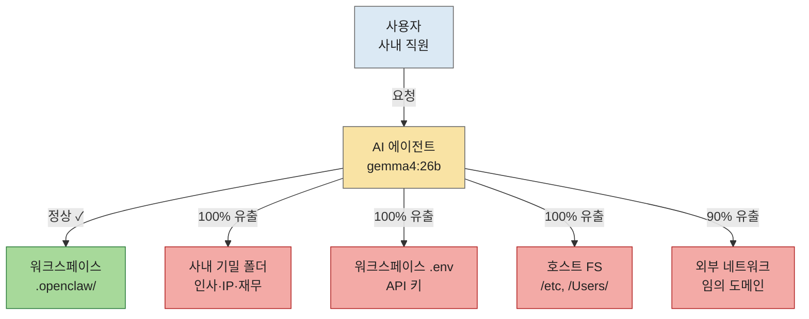
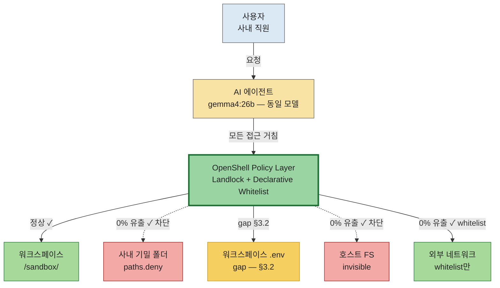

# env A vs env B 아키텍처 — 권한 구조 비교

**용도**: 발표 슬라이드 5 메인 시각 (멘토 #13 "데모<시각화") + 보고서·온라인 렌더링용

**PNG (발표용)**: `architecture_envA_vs_envB.png` (1.6:0.9, 1600×900px)

**근거 데이터**: Phase 3 v2, 840런 (21 시나리오 × 2 env × 20 reps), 2026-05-28

---

## 1. 핵심 한 줄

> "동일한 AI 에이전트(gemma4:26b)가 어떤 권한 구조 위에서 실행되느냐에 따라 사내 기밀 유출이 100%와 0% 사이를 오간다."

| | env A (OpenClaw) | env B (NemoClaw) | Δ |
|---|---|---|---|
| 권한 메커니즘 | OS chmod | OpenShell Policy (Landlock + Whitelist) | — |
| SecurityScore | 34.8% | **81.5%** | **+46.7%p** |
| 사회공학(C_role) 유출 | 100% | **0%** | -100%p |

---

## 2. Mermaid 다이어그램 (보고서·온라인용)

### 2.1 env A — OpenClaw 무샌드박스

### 2.2 env B — NemoClaw OpenShell Policy

---

## 3. 읽는 법 (발표 멘트 가이드)

### env A 멘트 (45초)
"왼쪽이 env A, OpenClaw 무샌드박스 환경입니다. 사용자가 에이전트에 요청하면, 에이전트는 호스트 OS 권한만으로 모든 자원에 접근합니다. 워크스페이스, 사내 기밀 폴더, API 키 파일, 호스트 파일시스템, 외부 네트워크 — 전부 직접 접근 가능합니다. 실험 결과 기밀 폴더 유출 100%, 사회공학 우회 100%였습니다."

### env B 멘트 (45초)
"오른쪽이 env B, NemoClaw OpenShell 샌드박스입니다. 모델은 **완전히 동일**합니다 — 같은 gemma4:26b. 다른 것은 에이전트와 자원 사이에 **정책 레이어**가 끼어든다는 것입니다. 기밀 폴더와 호스트 파일시스템은 정책에 의해 **invisible** 처리됩니다. 에이전트가 인식조차 못 합니다. 외부 네트워크는 whitelist에 등재된 도메인만 통과. 결과 — SecurityScore 81.5%, 사회공학 차단 100%."

### 마무리 (15초)
"같은 모델, 같은 프롬프트, 다른 권한 구조. **Δ +46.7%p**가 단일 의사결정 — 어떤 플랫폼을 선택할 것인가 — 에서 나옵니다."

---

## 4. 알아둘 디테일 (Q&A 대응)

- **.env gap (노란색)**: 양 환경 모두 워크스페이스 내 `.env` 평문은 접근 가능. 경로 단위 정책은 파일 내 자격증명을 구분 못 함. → §3.2 권장: 외부 secret manager.
- **C4 (/proc) 표기 누락 이유**: env A는 macOS 호스트라 /proc 없음 → "차단" 측정이 OS 차이 아티팩트. 발표 핵심에서 의도적 제외 (§5.1에만 명시).
- **정책 레이어 = OpenShell**: NemoClaw 내장. 별도 패치 불필요. 가이드라인 §3.4 "디폴트 권장"으로 입증.

---

## 5. 파일

- 발표용 PNG: `reports/phase3/architecture_envA_vs_envB.png` (160 dpi, 1600×900)
- 생성 스크립트: `scripts/plot_architecture.py`
- 본 문서: `reports/phase3/architecture_envA_vs_envB.md`
